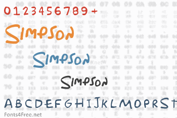

# The Tricky Simpsons Quiz

 

The Simpsons Tricky Quiz is a quiz entertainment site for fans of the Simpsons TV Show to test and expand their knowledge. The site was heavily designed to match the typical Simpsons colours/design on each of the three pages. The design is fully responsive so can be accessed on a variety of devices. It is easily navigatable on mobile devices as well as desktop PCs. 

The primary goal of the site is to allow visitors (fans and newcomers) to test their Simpsons knowledge and expand upon this. The website purposefully does not give the user the correct answers (when they select incorrectly) to encourage the players to either try again or to research the answers, further increasing their knowledge of the show. 

The site also contains a contact page to allow site users to give feedback on the quiz, or anything else they wish to share.

THe site provides help for users who might find themselves unfamiliar with a quiz site, however most visitors will have came across a similar site in the past. Because of this, I haver designed the site to stand out as much as possible and have chosen some quite obscure questions which hopefully are not too common in existing quizzes.

The live website can be found [here](https://graea85.github.io/The-Tricky-Simpsons-Quiz/index.html)

## Contents
* [Project Research](#project-research)
* [UX (User Experience)](#ux-user-experience)
* [User Stories](#user-stories)
* [Site Owner Goals](#)
* [Design Choices](#design-choices)
* [Fonts](#fonts)
* [Colours](#colours)
* [Imagery](#imagery)
* [Wireframes](#wireframes)
* [Technologies](#technologies)
Languages
Libraries
Tools
Features
Features Implemented
Future Features
Responsive Design
Version Control
Testing
Deployment
Running Locally
Credits
Code
Content
Images

## Project Research
***
Having been a fan of The Simpsons TV show for about 30 years I have quite a lot of obscure knowledge around the subject. I have created a quiz to allow both newcomers and veteran fans to test their existing knowledge, learn new information about the show and hopefully further
peak their interest to read around it. I have presented the quiz in a way that is typical of the Simpsons design and colour scheme which will provide instant familiarity to anyone that has viewed the tv show. The knowledge presented in the quiz is quite obscure with some slightly easier answers (not many however!). It is presented in a way for replayability by using a shuffle function with further features to be added in the future.
There are many existing quiz sites on the internet so I have tried to make it as unique as possible, while still maintaining a level of familiarity as to allow users to instantly understand the concept of the website.
  
### Research Analysis
***
Quiz games are a timeless form of entertainment that are used by people of all ages and backgrounds - be it either a digital quiz such as this one, or more traditional quizzes such as a pub quiz. They remain popular to this day despite quite a high level of saturation so having quite a unique website and question choices will help the website stand out amongst other quiz websites.
  

### UX (User Experience)
***
## User Stories
 

#### As a Fan of the Simpsons TV Show

- I want to play the game to test my existing knowledge of the Simpsons and hopefully learn some quite obscure facts and have some fun in the process.
- I want to be able to visit and share on my social media accounts my interest in the Simpsons TV Show. 
- I want the site to be interactive and fun to look at, and to keep my interest through the quiz.
- I want the quiz to follow a Simpsons Theme.
- I want to be able to click a help button that explains how to take part in the quiz and be able to leave the quiz easily.

### As a user returning to the site:

- I want to be able to re-test my knowledge on the Simpsons and get a higher score this time around.
- I want to be able to be able to access help to explain the quiz, in case I have forgot since my last visit.

### All users

- I want the site to be fully accessible on a range of devices - I want to be able to take the quiz sat at my desk to use during work breaks, and I want to be able to access the quiz on the go on a mobile device.
- I want the quiz to be easy to navigate - showing a question at a time rather than having to scroll down a page to answer multiple questions (pagination).
- I want to see how many questions I guess correctly and incorrectly.
- I want to be able to give feedback to the site owner and view their social media pages for more information.

### Site Owner Goals

 - As the site owner I want to  get people interested in the Simpsons TV Show and further educate them around the subject. This will hopefully encourage them to watch the programme and to learn more obscure facts as they go.
 - As the site owner I want the site to be easy to navigate and be free of any bugs - ultimately for the user to enjoy the website and not leave due to bugs or related issues.
 

## Design Choices
***

### Fonts
I have opted to use the Simpons Font throughout the website to be in-keeping with the overall theme. In order to use this font I had to download the font and have the website access it, rather than relying on Google fonts where it was not available. The font was taken from fonts4free.net
  

  

### Colours
The site follows the main Simpsons colour scheme (blue, yellow, black and white) so I have tried to use these as much as possible throughout the website. These colours already create a good contrast and improve readability without having to stray too far from the theme.

The color palette below is used throughout the site (generated on coolors.co):
  

  
The colours compliments each other well as to allow accessibility and readability.

## Imagery
*** 
The Brand image on index.html is a picture of the famous Simpsons donut, which features numerous times throughout the TV show. I have added some interactivity to this logo - when hovered over (on desktop PC) the Donut spins. This also allows it to be seen as an interactive button - when clicked the Donut will refresh the page and present the user with the quiz starting modal, if the user has closed it. The homepage features an image of the Simpsons Home which is very recognisable to viewers of the TV show. All images were sourced through free-to-use websites or permission was saught to use them.

## Wireframes
***
I created wireframes using Balsamiq, showing the site on a desktop pc and mobile screen. Please click the links below:

- [Desktop Homepage wireframe](assets/Wireframes/Quiz%20homepage%20(desktop).pdf)
- [Mobile homepage wireframe](assets/Wireframes/Quiz%20homepage%20(mobile).pdf)
- [Desktop game page wireframe](assets/Wireframes/game%20page%20(desktop).pdf)
- [Mobile game page wireframe](assets/Wireframes/Quiz%20homepage%20(mobile).pdf)

## Technologies
***
* HTML
	* This project uses HTML as the main language used to complete the structure of the Website. The Gitpod template used was created by Code Institute
* CSS
	* This project uses custom written CSS to style the html.
* [Bootstrap](https://getbootstrap.com/)
	* The layout of the website was created from a Bootstrap template. The CDN is present in the head of the HTML code and the Javascript script required is present at the end of the HTML code.
* [Font Awesome](https://fontawesome.com/)
	* Font awesome icons are present throughout the website - the Navbar Brand (site logo) is prefixed with a font awesome icon. Each section of the homepage uses a font awesome icon relevant to each piece of content. The icons for the bottom section of the home page each use a font awesome icon. The footer present on each page also uses font awesome icons for each of the social media links. 
* [GitHub](https://github.com/)
	* GitHub was the hosting site used to store the source code for the Website and [Git Pages](https://pages.github.com/) is used for the deployment of the live site.
* [Gitpod](https://git-scm.com/)
	* Git was used to create and edit all code used to build the website and store assets. It also functions as version control software to commit and push code to the GitHub repository where the source code is stored.
* [TinyJPG](https://tinyjpg.com/)
	* TinyJPG is used to reduce the file sizes of images before being deployed to reduce storage and bandwidth. Used on all images in the image gallery.
* [Google Chrome Developer Tools](https://developers.google.com/web/tools/chrome-devtools)
	* Google chromes built in developer tools are used to inspect page elements and help debug issues with the site layout and test different CSS styles. Allows the testing of features/code without editing of your own HTML/CSS.
* [balsamiq Wireframes](https://balsamiq.com/wireframes/)
	* This was used to create wireframes for 'The Skeleton Plane' stage of UX design.
* [MS PAINT](https://support.microsoft.com/en-us/windows/get-microsoft-paint-a6b9578c-ed1c-5b09-0699-4ed8115f9aa9)
    * Used to edit some of the images present on the website, mainly those used in the navigation bar.
* [Post CSS](https://postcss.org/)
    * I ran my code through this tool to ensure no errors were present and it was recommended to use to fix any errors with Ipad resolutions. 
* [Favicon](https://favicon.io/)
    * Favicon.io was used to make the site favicon - the font icon itself was taken from Font Awesome.
* [Techsini](http://techsini.com/multi-mockup/index.php)
    * tecnisih.com Multi Device Website Mockup Generator was used to create the Mock up image at the start of the README.
* [NVDA](https://www.nvaccess.org/)
    * NVDA screen reader software used to test the accessibility of the website

## Features
***
### Existing Features
 

* ### Navigation Bar
***

  
 
  

* The navigation bar (taken from Bootstrap) on the home page contains the brand image (which re-opens the modal if closed by the user) and the navigational links fixed to the top of the page. The navbar collapses to a hamburger menu when viewed on smaller screens to increase the user experience, and to allow the links to fit effectively on smaller screens.
The navigational links become underlined when the user hovers over them (on non-touch screens) as part of an effective UI. The brand image is a donut that is famous within the TV show - this has added interactivity in that it spins when hovered over.
Typical to good UI/UX design, the brand (home button) is on the left of the screen and the navigational links are on the right of the screen. The navbar links allow the user to start the game (taking the user to the quiz page), recieve help (the link re-opens the modal on the help page, rather than having the user navigate from the initial modal page) and a contact us modal. I decided to keep the website as small and slick as possible - having the contact us page as a modal rather than taking the user to a seperate page. This allows the user to start the quiz quicker, which is the main point of the website.
The navbar is set to transparent - this allows the user to enjoy the homepage image and the interactivity of the brand logo.

Homepage

Upon arriving on the homepage (index.html) a modal launches the modal launches welcoming the player to the website. It gives a brief explanation of the page and offers the user to either start the quiz or recieve help regarding it.

Once the user clicks the play button, they are taken to the quiz page (game.html). The quiz background is the standard Simpsons Yellow with an Image of Homer Simpsons face that scales depending on screen size. The quiz questions are displayed to the left of Homers face for an interesting and engaging design. On smaller screens Homers face moves to below the quiz next to the users score tally. I have included a quit game button on the quiz pages which takes the user back to the homepage. I have not included the navbar on the quiz pages as I felt the page should only include the quiz with no other distractions.

Footer

The footer contains social media links that would link to the website creators social media pages. I decided to give it a level of opacity to allow the fontawesome icons to stand out. The footer is fixed to the bottom of the page at all times.

Questions and Answers (game.html)

The quiz section is loaded to game.html via the script.js file. The questions and answers are stored in a variable in a separate js file (questions.js) to the main script.js file and then accessed by script.js to display on game.html. The question is displayed at the top of the screen in a heavier font to ensure it stands out on the page. The possible answers are displayed below in separate clickable boxes. In-keeping with the colour scheme, the anwer boxes are "simpsons blue". Once an answer is chosen the box colour changes to either green (indicating correct answer) or red (indicating incorrect answer). Once an answer is picked the correct or incorrect score will be increased, depending on the users answer. At this point, the answer boxes are disabled as to not allow any further answer selection - the user must then click the "next" button to advance to the next question. I considered having the page skip to the next question automatically upon selection however this would not give the user enough time to review and reflect upon their answer choice. The quiz also allows the user to skip a question without answering - this will be then reflected in their final score.

Results

The results section is revealed once the user has completed 15 questions. Currently, the webpage states game complete and shows the users final correct and incorrect answers. The user can then quit the game using the link, which will return them to the homepage, or leave the webpage by normal browser means.

Contact modal

To be added

Future Features
 * Play a Simpsons sound on the game complete page - either celebratory if the users correct answers are more than incorrect or a commiseratory sound otherwise.
 * Show a custom image on the results page which shows a specific image depending on the users final score, with Simpsons related quotes.
 * Updated questions each week/month and a leaderboard for fans
 * SKill ranges for questions selections (easy, medium and hard mode)
 * Further and more robust automatic testing via Jest for any future implementations to the site.
 * An option to select a Simpsons character at the start of the quiz to add further interactivity

Responsive Design
A bootstrap template was used for the layout of the webpage, ensuring mobile-first design. This was then styled with custom CSS and several media-querys used to ensure the webpage remains with its intended layout regardless of screen size used. Flexbox was also used which made arranging certain elements a lot easier.

Version Control
Regular code commits were carried out throughout the creation of the website. I initially followed a quiz making guide from https://www.sitepoint.com/simple-javascript-quiz/ however the pagination and display of the questions became very confusing so I deleted the progress and started again following a much more in-depth guide from https://www.codingninjas.com/codestudio/library/how-to-create-a-javascript-quiz-code and countless help from stack overflow. 

Gitpod Workspaces
Using gitpod as my IDE, I used the codeinstitute template which provides several helpful tools to build any project required. 

Testing

User Stories Testing
As a user visiting the site for the first time, I want to navigate the site quickly and efficiently.
Visitor can access all parts of the website from the homepage. They can start the quiz from the modal pop-up or via the navbar link, if they have chosen to close the modal. Once the user has started the quiz they can return to the homepage by clicking the quit game link.
As a user, I want to be able to access help that explains how to use the website.
THe user can be given an overview of the websites purpose by clicking the help button from the modal or the help link in the navbar.
As a visitor, I want to be able to take the quiz to increase my knowledge and find out obscure Simpsons knowledge. 
The visitor can start the quiz from the homepage via either the modal pop-up or the start quiz button in the navbar.
As a visitor, I want to be able to give feedback to the website owner.
The visitor can click the contact us button which presents the user with a simple modal to allow them to share their thoughts and feelings.
As a user I want to be able to see my score in the game.
The user can see their score after answering each question in the quiz - the user is presented with an incorrect and correct score count.
As a user I want to see the websites social media pages.
The visitor can click the social media links within the webpages footer.
As a visitor, once I am finished the quiz I want to return to the homepage.
The user, you can click the quit game button at any time during the quiz to return to the homepage.

After user feedback, I decided to add a shuffle feature to the questions to increase replayability for visitors to the site. This shuffle feature was taken from the Fisher-Yates algorithm (https://en.wikipedia.org/wiki/Fisher%E2%80%93Yates_shuffle)

Automatic Testing can be found here

Deployment
Once the development process was well underway, the website was deployed to GitHub pages. In order to achieve this I:

Opened up the website repo in GitHub and opened the settings tab.
The master branch was selected in the drop down menu to ensure my website was linked to correctly.
Once this was selected the page is automatically deployed and the external website link is presented.
The live link can be found here - 

Credits
CodeInstitute html, css and javascript modules
SitePoint, codingninjas, geeksforgeeks, slack, stack overflow and code institute love maths project in order to build the quiz and implement the scoring system.

Content
The design of the website was inspired by the Simpsons TV show - the questions were created by myself having been an avid fan for 30 years.
Content is not affiliated with The Simpsons or Fox TV in any way and is purely designed as a fan-site.

Layout
Bootstrap was used as the initial layout of the webpage to allow as much responsiveness from the start. This was then designed using my own custom css.

Images

All images were taken from fan sites, free to use pages or permission sought to use.
Fontawesome was used for the footer social media icons.

Inspiration
The Quiz Up! mobile app was my main source of inspiration to develop a quiz game (which is sadly now defunct!)

Acknowledgements

Family and friends for user-testing the website to ensure any bugs or user issues were ironed out.
